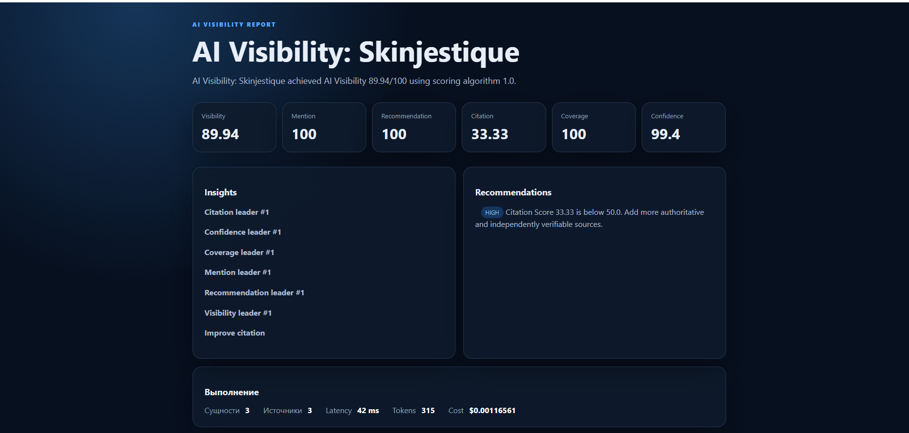
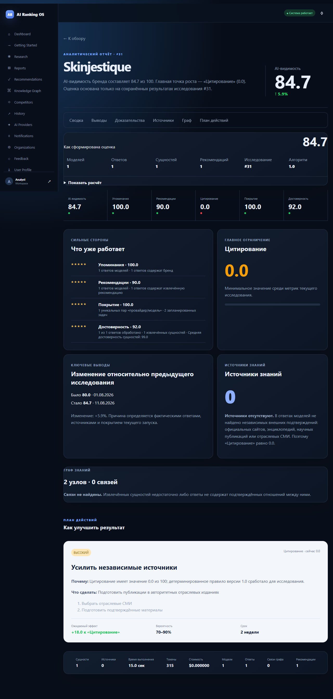

# BUG-003 — Report Credibility & Explainability

Дата: 11 августа 2026. Ветка: `bugfix/bug-003-report-credibility`.

## До / после

| До | После |
|---|---|
|  |  |

## Исправления

| Причина | Решение | Файлы |
|---|---|---|
| Visibility отображался без происхождения | Добавлена раскрываемая карточка расчёта: модели, ответы, сущности, рекомендации, research ID, версия алгоритма и формула весов | `frontend/src/main.tsx` |
| Citation=0 и Sources=0 выглядели пустыми | Отчёт объясняет, что независимые внешние подтверждения не обнаружены, перечисляет типы ожидаемых источников; найденные источники выводятся со ссылками | `frontend/src/main.tsx` |
| Strengths не содержали доказательств | Для каждой сильной метрики показаны значение и фактические counts из responses/entities/sources | `frontend/src/main.tsx` |
| Findings не объясняли базу сравнения | Показаны предыдущая и текущая точки с research dates, значениями и процентным изменением; при одной точке — честный insufficient state | `frontend/src/main.tsx` |
| Рекомендации выглядели общими | Подключены существующие Action Plan и Simulation: причина, шаги, ожидаемое изменение метрики, confidence range и срок | `frontend/src/api.ts`, `frontend/src/main.tsx` |
| Отчёт смешивал русский и английский | Заголовки, метрики, состояния, evidence и priority локализованы на русский; технические rule codes пользователю не показываются | `frontend/src/main.tsx` |
| Технический префикс и случайный регистр бренда | `AI Visibility:` удаляется, имя нормализуется для представления | `frontend/src/main.tsx` |
| Не было полной сводки запуска | Добавлены модели, ответы, сущности, источники, связи, рекомендации, токены, время и стоимость | `frontend/src/main.tsx` |
| Пустой Knowledge Graph не объяснял результат | Выводятся реальные node/edge counts либо причина отсутствия подтверждённых отношений | `frontend/src/main.tsx` |
| Длинная страница не имела структуры | Добавлена sticky-навигация: сводка → выводы → доказательства → источники → граф → план действий | `frontend/src/main.tsx`, `frontend/src/styles.css` |

## Реальные данные

Экран использует только существующие read-only API: `/research/{id}/final-report`, `/research-tasks`, `/research/{id}/action-plan` и `/research/{id}/simulation`. Frontend не создаёт score, прогноз, confidence, срок, source или graph relation. Если соответствующий persisted artifact отсутствует, показывается `не рассчитано` либо объяснённый Empty State.

## Проверки

- Ruff: PASS.
- Pytest: 287 PASS.
- Compileall: PASS для существующих Python packages.
- TypeScript: PASS.
- ESLint: PASS.
- Frontend production build: PASS.
- Playwright: 4 PASS; 2 production-only сценария SKIPPED без production credentials.
- Визуальная проверка Chromium full-page screenshot: PASS; необъяснимых чисел, пустых карточек Citation/Sources/Graph и смешанной локализации внутри отчёта не обнаружено.

## Ручная проверка

1. Войти и открыть `/reports/latest`.
2. Сверить research ID, модель/ответы, сущности, score version, tokens, time и cost с Network response `GET /api/research/{id}/final-report`.
3. Нажать «Показать расчёт» и проверить формулу Visibility.
4. При Citation=0 убедиться, что отображается причина, а не пустая карточка.
5. Сверить «Было/Стало» с двумя последними точками trend payload.
6. Сверить steps/effect/confidence/time с Action Plan и Simulation responses.
7. Открыть ссылки источников; при их отсутствии проверить объяснение.
8. Проверить node/edge counts и сообщение при edge_count=0.
9. Пройти якорную навигацию и убедиться, что DevTools Console не содержит ошибок.

## Ограничения

- Причина изменения метрики формулируется только из доступных фактических сигналов; causal attribution, которого нет в сохранённых данных, не выдумывается.
- Старые исследования без Action Plan или Simulation показывают «не рассчитано».
- Production-only браузерный smoke выполняется после merge/deployment и не заявлен этим PR.
