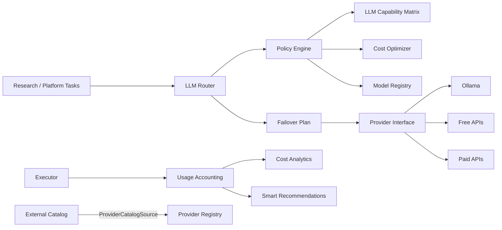

# EPIC 10 — Intelligent LLM Routing & Cost Optimization

## Status

Feature complete on `feature/epic-10-intelligent-llm-routing`. Public API compatibility is
preserved; provider SDKs and transports remain behind the common `Provider` port.

## Architecture

Dependency direction is Ports & Adapters: Research never imports Ollama, OpenAI, or provider
transports. Provider discovery and research usage are connected through dedicated public ports.

## Delivered modules

- Native Ollama adapter: chat, JSON, streaming, embeddings, tools, health and discovery.
- Database-backed Provider Registry for 15 provider families and capability matrix API.
- Versioned Model Registry with immutable snapshots and empirical benchmark fields.
- Intelligent Router strategies: FASTEST, CHEAPEST, LOCAL_ONLY, FREE_ONLY,
  HIGHEST_QUALITY, BALANCED and CUSTOM.
- Task-aware Policy Engine with user-overridable strategy and budgets.
- Cost Optimizer with daily, monthly and per-research limits plus preflight estimates.
- Automatic provider failover and normalized failure classification.
- Model Benchmark and Model Evaluation engines.
- Empirical LLM Capability Matrix wired into routing quality scores.
- Fully local and configurable hybrid routing modes.
- Provider catalog discovery and startup/manual synchronization.
- Cost Analytics and post-research Smart Provider Recommendations.
- AI Providers UI with Models, Policies, Router, Benchmarks, Costs, Failover and Health sections.

## Routing

The router first applies context/capability/region/circuit constraints, then task policy and
requested strategy, empirical quality, cost limits and mode ordering. Explicit request settings
take precedence over task defaults. LOCAL mode guarantees that only LOCAL-tier models enter the
execution plan. Hybrid ordering supports LOCAL→FREE→PAID, LOCAL→PAID and FREE→PAID.

## Provider and Model Registry

Provider records contain capabilities, pricing source, context window, availability, free tier
and priority. Model records add versions, release dates, throughput, average latency, benchmark
quality and explicit reasoning/multimodal/embedding/JSON/tool flags. Updates create immutable
version snapshots.

## Cost Optimizer

`POST /router/estimate` returns selected models, estimated time, tokens, cost and budget status.
Wizard review exposes the same estimate before research starts. Execution usage is the source for
actual cost, free/paid tokens and breakdowns by research, model and user.

## Failover

Fallback order is Ollama → Groq → Gemini → GitHub Models → OpenAI. Unregistered or unavailable
providers are skipped. Executor retry/timeout/cancellation behavior remains the execution
authority; the router only produces the ordered plan.

## Compatibility and performance

- Existing endpoints and five production routing policies are preserved.
- New Pydantic fields are additive and have safe defaults.
- Frontend production bundle remains below the 200 KB gzip budget.
- Router selection is deterministic; empirical matrix queries are grouped and indexed.
- Alembic revisions `0043`–`0051` include reversible downgrades.

## Known limitations

- External credentials remain opt-in; mock mode is the safe default.
- Provider catalog synchronization requires `PROVIDER_CATALOG_URL`.
- Tool calling depends on the capabilities reported by each installed Ollama model.
- Quality evaluation v1 is deterministic and intentionally simple; future versions can add
  human or judge-model calibration without changing stored versioned contracts.
