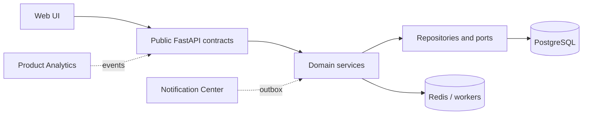

# EPIC 11 — Product Readiness Final

## Status

EPIC 11 is feature complete for architectural review. Development stops after
TASK-1121; no EPIC 12 work is included.

## Completed work

- Product Analytics with internal events, sessions, aggregates, exports and UI.
- Notification Center with in-app/email delivery ports, future webhooks, lifecycle,
  categories, priorities and outbox history.
- Organization Workspace with switching, members, invitations, roles, projects,
  limits and activity history.
- Settings Center over Authentication, API Keys, Providers, Workspace and Organization.
- Admin Console covering Users, Organizations, Research, Reports, Providers, Jobs,
  Feedback, Product Analytics, Audit, Health and Settings.
- Closed Beta onboarding, demo organization/users/projects/research and operating docs.

## Data and API

Migrations `0069`, `0070` and `0071` add Product Analytics, expanded notifications
and Organization Workspace. Settings, Admin Console and Beta Readiness reuse public
contracts and require no new storage. OpenAPI exposes 228 paths and remains backward
compatible.

## Architecture

The new UI surfaces are orchestration-only. Domain ownership remains with their
existing services; no UI imports internal domain models and no circular dependency
was introduced.

## User journey

Invite → login → onboarding → organization → Skinjestique research → automatic
pipeline → report → notification → share/export → feedback → product analytics.

## Validation and limitations

Local gates cover Ruff, full Pytest, compileall, TypeScript, frontend build,
Playwright and OpenAPI. GitHub Actions additionally validates PostgreSQL migration
upgrade/downgrade, Docker and production Compose. Live provider quality and external
email delivery still require environment credentials; webhook delivery remains a
prepared future port. Demo passwords are never committed and must be supplied and
rotated by operations.

## Before Closed Beta

Deploy the reviewed commit, execute the production checklist, perform a restore
drill, seed or create invited demo users, run the public Skinjestique journey and
confirm monitoring ownership. Future scope must be based on real usage and feedback.
